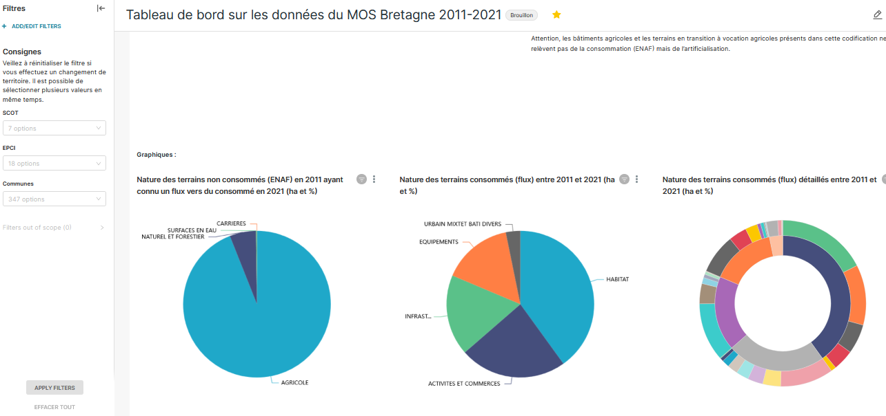
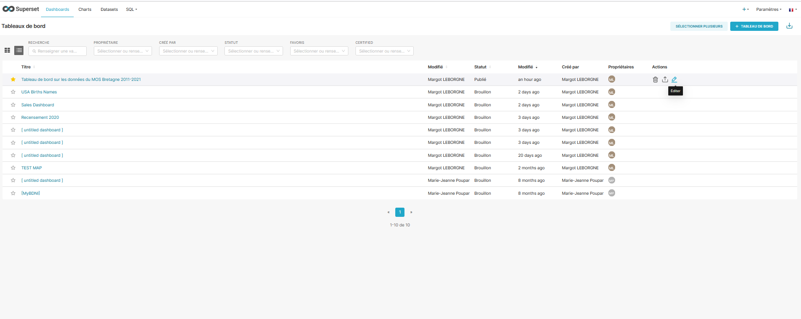
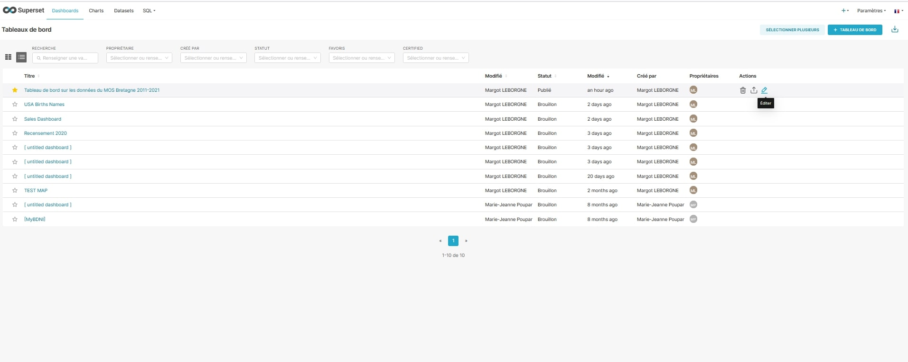

# 📊 Couleurs personnalisées dans les graphiques

Sur Superset, les couleurs des graphiques sont déterminées par un jeu de couleur pouvant être paramétré. Cependant, il existe la possibilité de paramétrer des couleurs pour vos graphiques selon les variables dans votre jeu de donnée.

Prenons un exemple, le tableau de bord concernant les données du MOS. Ici, nous avons des graphiques avec plusieurs couleurs. "AGRICOLE" en bleu, "EQUIPEMENTS" en orange ect.&#x20;

**Nous souhaitons attribuer à chaque "libellé" une couleur différente.**&#x20;


<figure><figcaption><p>Ancienne couleur </p></figcaption></figure>

***

#### Voici la marche à suivre :&#x20;

1. Aller dans l'onglet "Dashboard", choisir la ligne de votre tableau de bord, puis cliquer sur "Éditer" à droite de l'image :&#x20;


<figure><figcaption><p>Crayon / Éditer</p></figcaption></figure>

<div data-full-width="false">

<figure><figcaption></figcaption></figure>

</div>

2. Dans la partie JSON MEDATA vous pouvez personnaliser certaines caractéristiques du tableau de bord (comme les couleurs par exemple). Attention, il vous faudra utiliser le format JSON pour la syntaxe.&#x20;

* Cliquer sur Avancé en bas de la fenêtre.&#x20;
* Vous pouvez maintenant voir le code JSON. Ici, dans le tableau de bord est paramétré sur les couleurs "GoogleCategory10c".&#x20;

<figure><figcaption><p>Avancé / code JSON</p></figcaption></figure>

3. Changer le code JSON.&#x20;

Reparter bien du code déjà présent  dans votre syntaxe JSON.

Sur l'image précédente, nous pouvons voir la ligne en jaune, **"label\_colors" : {} ,**

Cela signifie que les libellés de couleur ne sont pas personnalisés.&#x20;

Si vous souhaitez appliquer la même couleur à un label spécifique (par exemple, "AGRICOLE") dans tous les graphiques de votre tableau de bord, vous pouvez le faire de manière globale sans avoir besoin de spécifier l'ID de chaque graphique. Voici comment vous pouvez ajouter une couleur personnalisée pour le label "AGRICOLE" dans l'ensemble du tableau de bord :


```
"label_colors": {
    "AGRICOLE": "#88FF88" // Utilisez la couleur de votre choix. Ici du vert
  },
```



**Votre libellé doit avoir exactement la même orthographe / casse que dans votre base de donnée.**&#x20;


Puis, supprimer la ligne de code concernant le thème de couleur ou laisser juste les "".


```
"color_scheme": "googleCategory10c",
```

Il est possible de modifier seulement les couleurs d'un graphique en particulier dans le tableau de bord. Pour cela, il faut trouver l'ID du graphique : aller dans editer le graphique et regarder l'id dans la barre internet, tout à gauche.

<figure><figcaption><p>ici on a ID:10</p></figcaption></figure>

Voila ce que donnerait le code pour modifier le graphique 10, libellé "AGRICOLE" en vert :

```
"chart_configuration": {
    "10": {
      "id": 10,
      "crossFilters": {
        "scope": "global",
        "chartsInScope": [
          // ...
        ]
      },
      "color_scheme": {
        "label_colors": {
          "AGRICOLE": "#88FF88" // Utilisez la couleur verte de votre choix
        }
      }
    }
  }

```

Pour mettre à jour les couleurs de toutes les catégories présentes dans les données sur tous le tableau de bord, voici le code des "label\_colors" :&#x20;

Certains libellés comportent des espaces exemple "AGRICOLE " car il y a un espace dans la base de donnée.&#x20;


```
"label_colors": {
    "HABITAT ": "#ef3b2c",
    "Habitat individuel ": "#ff0000",
    "Habitat collectif ": "#ff5500",
    "Voie desserte habitat ": "#ffaa00",
    "Terrain vacant - habitat ": "#ffcc00",
    "Jardins maisons (unité foncière) ": "#ffd400",
    "ACTIVITES ET COMMERCES ": "#edc4d9",
    "Activité tertiaire ": "#ff9ecc",
    "Activité autre que tertiaire : industrie et artisanat ": "#ff93c8",
    "Surface commerciale ": "#ff88c3",
    "Activités autres que tertiaires : logistique and stockage ": "#ff7ec0",
    "Activités multiples ": "#ff74bd",
    "Voie desserte activité ": "#ff6ab9",
    "Terrain vacant - activité ": "#ff60b6",
    "Jardins activité (unité foncière) ": "#ff56b2",
    "AGRICOLE ": "#f2d70b",
    "Bâtiment agricole ": "#ffe80a",
    "Terrain vacant - agricole ": "#ffeb0a",
    "Serre ": "#ffe80a",
    "Terre agricole ": "#ffe50a",
    "Carrière ": "#e83dde",
    "Défense (anthropisé) ": "#2c2c2c",
    "Equipement d'enseignement ": "#bbbbbb",
    "Equipement de santé ": "#cacaca",
    "Autre équipement local, administration ": "#dbdbdb",
    "Equipement pour eau, assainissement, énergie ": "#e6e6e6",
    "Equipement sportif (construit) ": "#b14141",
    "Hôtel ": "#db5e5e",
    "Cimetière ": "#f79292",
    "Sport et loisir ": "#d4d4d4",
    "Parc et jardin ": "#e4e4e4",
    "Infrastructure de transport ": "#d26969",
    "Autre infrastructure ": "#de7b7b",
    "Parking non construit ": "#ea8c8c",
    "Parking construit ": "#f3a5a5",
    "Terrain vacants infrastructures (chantiers) ": "#ffb0b0",
    "Espaces naturels et agricoles aéroports ": "#ffbebe",
    "Chemin-sentier ": "#ffcccc",
    "Caravanage ": "#79b741",
    "Espace naturel ": "#85c14d",
    "Espace boisé ": "#91c35a",
    "Plage, dune et sable ": "#9dc467",
    "Rocher et falaise ": "#a8c574",
    "Espaces \"naturels\" militaires ": "#b4c681",
    "Plan d'eau ": "#66cfdb",
    "Réseau hydrographique ": "#6dd7ea",
    "Maritime nature ": "#74dfff",
    "Urbain mixte (habitat/activité tertiaire) ": "#ff916a",
    "Bâti divers ": "#ff9c7b",
    "Bâtiment remarquable ": "#ffa88d",
    "Voie desserte mixte ": "#ffb39e",
    "Terrain vacant - autre ": "#ffbfaf"
  }
  // Le reste de votre configuration
}

```

4. Enregistrer les modifications (si il y a une erreur dans le code, il y aura une alerte), puis vérifier que le changement de couleurs à bien été effectué.

Vous pouvez vous aider de **ChatGPT** pour lui demander des couleurs aléatoires ou selon vos critères en lui donnant juste le nom de vos catégories. Ici j'ai choisi de mettre "AGRICOLE " en jaune, "NATUREL ET FORESTIER " en vert, "HABITAT " en rouge, "EQUIPEMENTS" en gris, et de faire les sous catégories par rapport à ces couleurs de base.

**Et voila le résultat :**&#x20;

<figure><figcaption><p>résultat couleurs</p></figcaption></figure>
